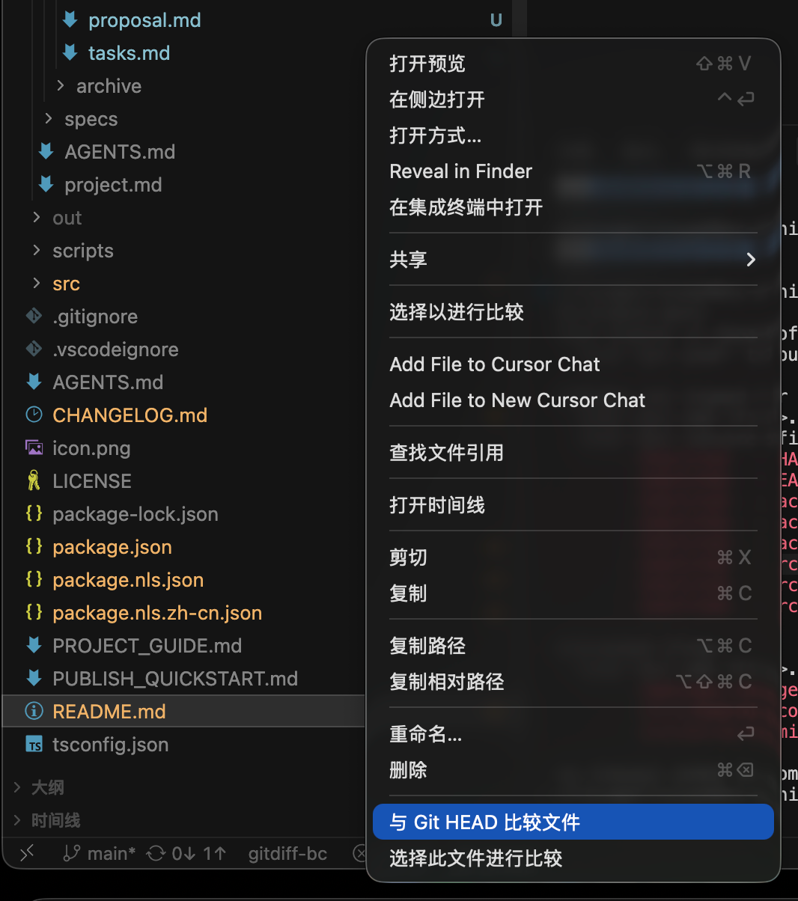
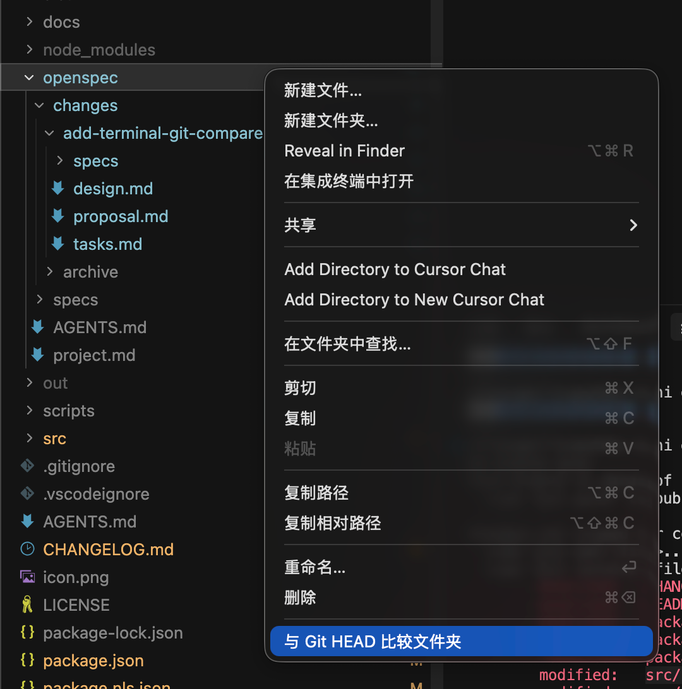
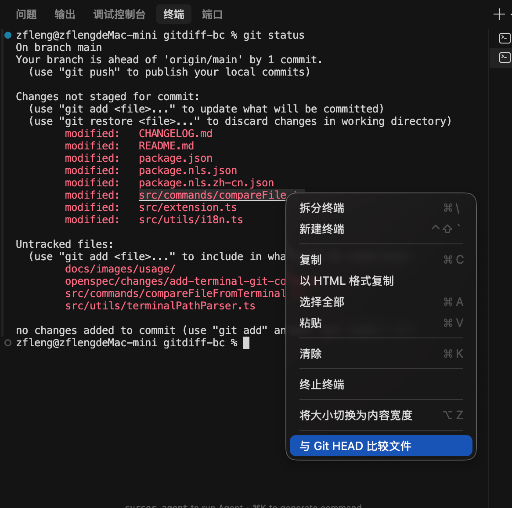

# GitDiff BC - Beyond Compare Git 对比工具

[](https://github.com/sunbo008/gitdiff-bc)
[](https://github.com/sunbo008/gitdiff-bc/releases)
[](https://opensource.org/licenses/MIT)

一个 VSCode / Cursor 扩展，使用 Beyond Compare 快速比较文件/文件夹与 Git 历史版本。

## 功能特性

✨ **右键菜单集成** - 在资源管理器中右键即可快速比较
🔍 **文件比较** - 比较单个文件与 Git HEAD 版本
📁 **文件夹比较** - 比较整个文件夹与 Git HEAD 版本
🆕 **任意两个文件比较** - 选择工作区中的任意两个文件进行比较
🌍 **跨平台支持** - 完美支持 Windows、macOS 和 Linux
🎯 **自动检测** - 自动检测 Beyond Compare 安装路径
⚙️ **灵活配置** - 支持自定义 Beyond Compare 路径和日志级别
🌐 **多语言支持** - 支持中英文界面，自动适配 VSCode 语言设置

## 兼容性

- ✅ **VSCode** 1.60.0 或更高版本
- ✅ **Cursor** 完全兼容（基于 VSCode 构建）
- ✅ **Windows** / **macOS** / **Linux**

## 安装

### 📦 从 VSCode Marketplace 安装（推荐）

1. 在 VSCode/Cursor 中打开扩展面板（`Ctrl+Shift+X` / `Cmd+Shift+X`）
2. 搜索 **"GitDiff BC"** 或 **"Beyond Compare Git"**
3. 点击**安装**按钮

### 💾 离线安装（从 VSIX 文件）

如果您在企业内网环境、离线环境，或需要安装特定历史版本，可以从 GitHub Releases 下载 VSIX 文件手动安装：

#### 步骤 1: 下载 VSIX 文件

访问 **[GitHub Releases](https://github.com/sunbo008/gitdiff-bc/releases)** 页面：

1. 选择您需要的版本（建议下载最新版本）
2. 在 **Assets** 区域找到 `gitdiff-bc-<版本号>.vsix` 文件
3. 点击下载（例如：`gitdiff-bc-0.1.5.vsix`）

#### 步骤 2: 安装 VSIX 文件

**方法 1：通过 VSCode/Cursor UI 安装**

1. 打开 VSCode/Cursor
2. 打开扩展面板（`Ctrl+Shift+X` / `Cmd+Shift+X`）
3. 点击扩展面板右上角的 `...` 菜单按钮
4. 选择 **"从 VSIX 安装..."** (Install from VSIX...)
5. 在文件选择对话框中找到下载的 `.vsix` 文件并选择
6. 等待安装完成，重新加载窗口

**方法 2：通过命令行安装**

```bash
# VSCode
code --install-extension gitdiff-bc-0.1.5.vsix

# Cursor（根据具体安装位置）
cursor --install-extension gitdiff-bc-0.1.5.vsix
```

#### 适用场景

- 🏢 **企业内网环境** - 无法访问 VSCode Marketplace
- 🔒 **离线环境** - 没有互联网连接
- 📌 **特定版本** - 需要安装或测试特定历史版本
- 🚀 **批量部署** - 需要在多台机器上部署相同版本

## 前置要求

1. **Beyond Compare** - 需要安装 Beyond Compare（v3 或 v4）

   - 下载地址: https://www.scootersoftware.com/
2. **Git** - 需要安装 Git 2.0 或更高版本

   - 下载地址: https://git-scm.com/

## 使用方法

### 比较文件与 Git HEAD

1. 在 VSCode/Cursor 资源管理器中找到要比较的文件
2. 右键点击文件
3. 选择 **"与 Git HEAD 比较文件"** (Compare File with Git HEAD)
4. Beyond Compare 会自动打开，显示文件与 Git HEAD 版本的差异



### 比较任意两个文件 🆕

**方式1：多选直接比较（推荐）**

1. 按住 `Ctrl` (Windows/Linux) 或 `Cmd` (macOS) 键
2. 同时选中两个要比较的文件
3. 右键点击其中任一文件
4. 选择 **"比较选中的文件"** (Compare Selected Files)
5. Beyond Compare 会自动打开，显示两个文件的差异

**方式2：分步选择**

1. 右键点击第一个文件，选择 **"选择此文件进行比较"**
2. 状态栏会显示已选中的文件名（点击可清除选择）
3. 右键点击第二个文件，选择 **"与已选文件比较"**
4. Beyond Compare 会自动打开，显示两个文件的差异

> 💡 **提示**: 此功能不需要 Git 仓库，可以比较工作区中的任意两个文件！

### 比较文件夹

**方式 1：右键点击文件夹**

1. 在资源管理器中右键点击要比较的文件夹
2. 选择 **"与 Git HEAD 比较文件夹"** (Compare Folder with Git HEAD)
3. Beyond Compare 会打开该文件夹与 Git HEAD 版本的比较视图



**方式 2：比较整个工作区（快捷方式）**

1. 在资源管理器空白区域右键点击
2. 选择 **"与 Git HEAD 比较文件夹"** (Compare Folder with Git HEAD)
3. Beyond Compare 会打开整个工作区根目录与 Git HEAD 版本的比较视图

### 从终端比较文件 🆕

**单文件比较：**

1. 在终端运行 `git status` 查看修改的文件
2. 用鼠标**选中**一个文件路径（如 `platform/mac/App.mm`）
3. 在终端右键，选择 **"与 Git HEAD 比较文件"**
4. Beyond Compare 会自动打开，显示该文件与 Git HEAD 的差异
   

**批量比较多个文件：**

1. 在终端运行 `git status`
2. 用鼠标**选中**多行文件路径（如选中 3-5 个修改的文件）
3. 在终端右键，选择 **"与 Git HEAD 比较文件"**
4. 扩展会依次打开 Beyond Compare 比较每个文件
5. 显示进度提示和完成摘要

**支持的路径格式：**

- `modified:   src/file.ts` - git status 标准格式
- `new file:   src/utils/parser.ts` - 新文件格式
- `    src/file.ts` - 带缩进的路径
- `src/file.ts` - 纯路径
- `src/file with spaces.ts` - 包含空格的路径

> ⚠️ **Windows 用户注意**: 如果在终端右键时触发粘贴而非显示菜单，请调整以下设置：
>
> 1. 打开设置（`Ctrl+,`）
> 2. 搜索 `terminal.integrated.rightClickBehavior`
> 3. 将其设置为 `"default"` 或 `"selectWord"`
   
## 配置

在 VSCode/Cursor 设置中搜索 "Beyond Compare" 可以找到以下配置项：

### `beyondCompare.executablePath`

自定义 Beyond Compare 可执行文件路径。留空则自动检测。

**默认值**: `""`（自动检测）

**示例**:

- Windows: `"C:\\Program Files\\Beyond Compare 4\\BCompare.exe"`
- macOS: `"/Applications/Beyond Compare.app/Contents/MacOS/bcomp"`
- Linux: `"/usr/bin/bcompare"`

### `beyondCompare.logLevel`

设置日志输出级别，用于问题排查。

**可选值**: `"error"`, `"warn"`, `"info"`, `"debug"`
**默认值**: `"info"`

查看日志：打开 **输出面板** (Ctrl+Shift+U / Cmd+Shift+U)，选择 **"Beyond Compare Git"** 频道。

## 自动检测路径

扩展会按以下顺序查找 Beyond Compare：

1. ✅ **用户配置** - 检查 `beyondCompare.executablePath` 设置
2. ✅ **默认安装路径** - 检查系统默认安装位置
   - Windows: `C:\Program Files\Beyond Compare 4\BCompare.exe`
   - macOS: `/Applications/Beyond Compare.app/Contents/MacOS/bcomp`
   - Linux: `/usr/bin/bcompare`
3. ✅ **PATH 环境变量** - 从系统 PATH 中查找

## 常见问题

### ❓ 提示"未找到 Beyond Compare"

**解决方法**:

1. 确认已安装 Beyond Compare
2. 在设置中手动配置 `beyondCompare.executablePath`
3. 检查文件路径是否正确（注意 Windows 路径需要双反斜杠 `\\`）

### ❓ 提示"文件不在 Git 版本控制中"

**原因**: 该文件是新创建的，尚未提交到 Git

**解决方法**: 先将文件添加到 Git 并提交：

```bash
git add <文件名>
git commit -m "提交说明"
```

### ❓ 提示"当前目录不是 Git 仓库"

**原因**: 文件所在的目录不是 Git 仓库

**解决方法**: 在该目录下初始化 Git 仓库：

```bash
git init
```

## 📚 文档

### 📖 深入了解

- 📌 **[项目指南](PROJECT_GUIDE.md)** - 项目全面介绍和开发指南
- 📑 [文档索引](docs/README.md) - 完整文档导航

### 用户文档

- 📖 [快速开始指南](docs/user/QUICKSTART.md) - 5分钟上手教程
- 📥 [安装指南](docs/user/INSTALL_GUIDE.md) - 详细的安装步骤
- 🌐 [国际化指南](docs/user/I18N_GUIDE.md) - 多语言支持说明
- 🔧 [故障排查](docs/user/TROUBLESHOOTING.md) - 常见问题解决方案

### 开发者文档

- 🏗️ [构建指南](docs/developer/BUILD_GUIDE.md) - 构建和打包流程
- 🛠️ [脚本使用说明](scripts/USAGE.md) - 开发和调试工具
- 🚀 [发布指南](docs/PUBLISH.md) - VSCode Marketplace 发布详细文档
- ⚡ [快速发布](PUBLISH_QUICKSTART.md) - 一页纸快速发布指南

### 维护文档

- 🔄 [重新安装指南](docs/maintenance/REINSTALL.md) - 完全重新安装步骤
- ⚙️ [设置修复](docs/maintenance/SETTINGS_FIX.md) - 配置问题修复

## 许可证

MIT License - 详见 [LICENSE](LICENSE) 文件

## 问题反馈

如果遇到问题或有功能建议，欢迎在 GitHub 仓库提交 Issue：

- 🐛 **Bug 报告**: [提交 Bug](https://github.com/sunbo008/gitdiff-bc/issues/new?labels=bug)
- 💡 **功能建议**: [提交建议](https://github.com/sunbo008/gitdiff-bc/issues/new?labels=enhancement)
- 📋 **查看所有 Issues**: [Issues 列表](https://github.com/sunbo008/gitdiff-bc/issues)

**GitHub 仓库**: [https://github.com/sunbo008/gitdiff-bc](https://github.com/sunbo008/gitdiff-bc)

## 更新日志

查看 [CHANGELOG.md](CHANGELOG.md) 了解版本更新历史。

---

**享受更高效的代码比较体验！** 🚀
